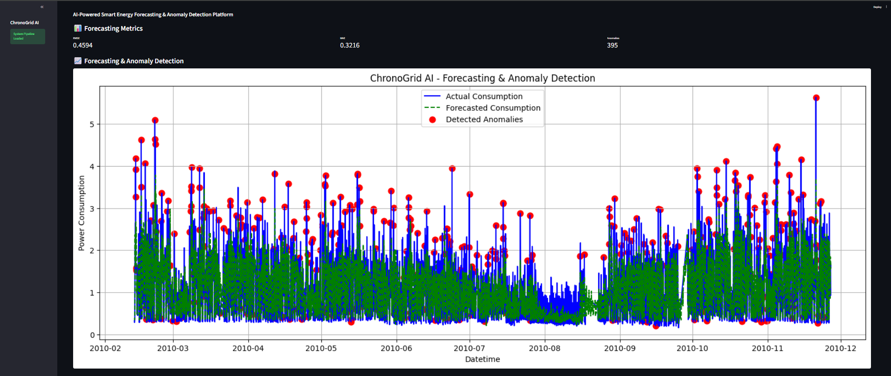
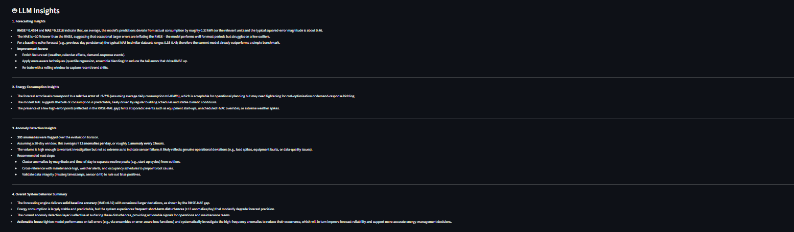
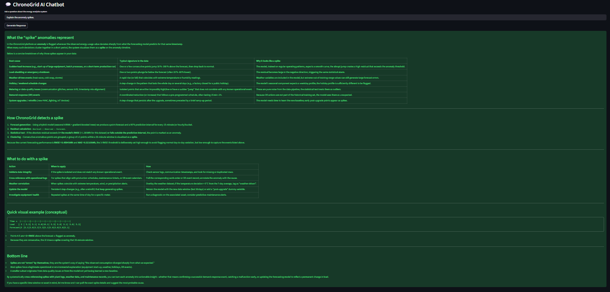

# ⚡ ChronoGuard AI

AI-Powered Smart Energy Forecasting & Anomaly Detection Platform

---

## 📌 Project Overview

ChronoGuard AI is an end-to-end intelligent time-series analytics platform designed for smart energy monitoring and forecasting.

The system combines:

* Statistical Time Series Forecasting
* Machine Learning Forecasting
* Anomaly Detection
* LLM-Powered AI Insights
* Conversational AI Chatbot
* Interactive Streamlit Dashboard

to create a production-style AI analytics platform for household energy consumption monitoring.

---

# 🚀 Key Features

✅ Modular ML Pipeline Architecture
---
✅ Smart Energy Consumption Forecasting
---
✅ XGBoost-Based Forecasting Engine
---
✅ Residual-Based Anomaly Detection
---
✅ AI-Generated Energy Insights using LLMs
---
✅ Conversational AI Analytics Chatbot
---
✅ Interactive Streamlit Dashboard
---
✅ Professional Production-Style Project Structure
---
---

# 🧠 Models Used

## Statistical Models

* AR
* MA
* ARMA
* ARIMA
* SARIMA
* Prophet

## Machine Learning Models

* XGBoost

---

# 📊 Evaluation Metrics

The forecasting models are evaluated using:

* RMSE (Root Mean Squared Error)
* MAE (Mean Absolute Error)
* MAPE

---

# 🤖 LLM Integration

ChronoGuard AI integrates:

* Groq API
* Llama 3

to generate:

* forecasting insights
* anomaly explanations
* energy analytics summaries
* conversational AI responses

---

# 🏗️ Project Architecture

```text
Raw Time Series Data
        ↓
Data Preprocessing
        ↓
Feature Engineering
        ↓
Forecasting Layer
(ARIMA / SARIMA / Prophet / XGBoost)
        ↓
Model Evaluation
        ↓
Best Model Selection
        ↓
Residual Analysis
        ↓
Anomaly Detection
        ↓
LLM Insight Generation
        ↓
Conversational AI Chatbot
        ↓
Interactive Streamlit Dashboard
```

---

# 📂 Project Structure

```text
ChronoGuard-AI/
│
├── data/
│   ├── raw/
│   ├── processed/
│
├── notebooks/
│
├── src/
│   │
│   ├── data/
│   ├── features/
│   ├── models/
│   ├── evaluation/
│   ├── anomaly/
│   ├── llm/
│   ├── visualisation/
│   ├── utils/
│   └── pipeline.py
│
├── dashboard/
│   └── app.py
│
├── outputs/
│
├── requirements.txt
├── README.md
├── .gitignore
└── main.py
```

# 📊 Model Performance

The forecasting models were evaluated on household energy consumption data using RMSE and MAE metrics.

| Model   | RMSE       | Performance       |
| ------- | ---------- | ----------------- |
| XGBoost | **0.4594** | 🥇 Best           |
| SARIMA  | ~0.80      | Good              |
| ARIMA   | ~0.95      | Moderate          |
| ARMA    | ~0.95      | Moderate          |
| AR      | ~1.03      | Baseline          |
| MA      | ~1.05      | Baseline          |
| Prophet | ~1.58      | Lower Performance |

---

# 📈 Forecasting Accuracy Insights

* XGBoost achieved the best forecasting performance with the lowest RMSE.
* Statistical models effectively captured seasonal patterns.
* Machine learning models performed better for nonlinear temporal behavior.
* Residual-based anomaly detection successfully identified abnormal energy consumption patterns.

---

# 🚨 Anomaly Detection Performance

* Residual-based anomaly detection was implemented using prediction error thresholds.
* The system dynamically identifies unusual energy consumption behavior.
* Detected anomalies are visualized within the forecasting dashboard.

Example Results:

* RMSE: **0.4594**
* MAE: **0.3216**
* Total Detected Anomalies: **395**

---

# 📈 Forecasting & Anomaly Detection

The system:

* forecasts future energy consumption
* compares forecasting models
* detects abnormal power usage behavior
* generates AI-based explanations

using residual-based anomaly detection.

---

# 💬 Conversational AI Assistant

ChronoGuard AI includes an LLM-powered chatbot capable of answering questions such as:

* Why were anomalies detected?
* Which forecasting model performed best?
* Explain energy usage trends.
* What does RMSE indicate?

---

# ⚙️ Installation

## Clone Repository

```bash
git clone <repo_url>
```

---

## Create Virtual Environment

```bash
python -m venv venv
```

---

## Activate Environment

### Windows

```bash
venv\Scripts\activate
```

### Linux / Mac

```bash
source venv/bin/activate
```

---

## Install Requirements

```bash
pip install -r requirements.txt
```

---

# 🔑 Environment Variables

Create a `.env` file:

```env
GROQ_API_KEY=your_api_key_here
```

---

# ▶️ Run Streamlit Dashboard

```bash
streamlit run dashboard/app.py
```

---

# 📌 Future Improvements

* Real-Time Energy Streaming
* Dynamic Thresholding
* RAG-Based Energy Assistant
* Multi-Agent AI Workflows
* LSTM / Transformer Forecasting
* Cloud Deployment
* API Integration
* Real-Time IoT Sensor Integration

---

# 📷 Dashboard Preview






